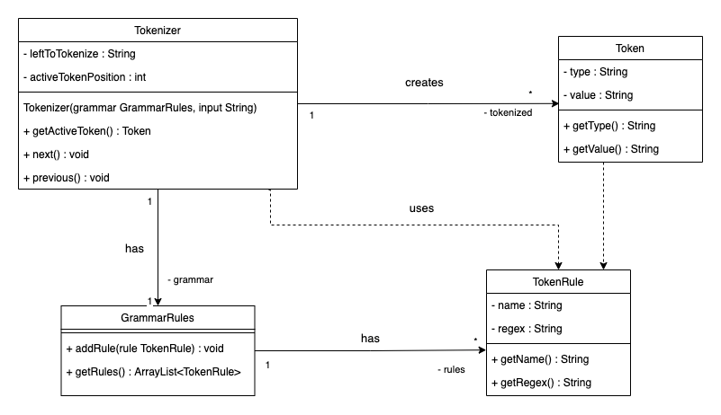

# Tokenizer
[Example](https://gitlab.lnu.se/1dv610/student/pr222ja/l1/-/blob/master/README.md#example)

[Class Diagram](https://gitlab.lnu.se/1dv610/student/pr222ja/l1/-/blob/master/README.md#class-diagram)

## About
The Tokenizer is used to transfrom an input string into a list of tokens. To achieve this the Tokenizer takes in the input together with a set of grammar rules, which have regex-expressions. The regex is used by the Tokenizer for matching the input string. From a match the tokenizer will 

The whole input won't immediatelly be matched and tokenized at the creation of Tokenizer. Instead, it will only try to tokenize the first possible match, and then that will become the first active token. For subsequent matches you need to use the next()-method on the Tokenizer.

When all tokens have been processed, and you proceed with next(), you will get to the last token by the type 'END' that indicates that no more input is left to be tokenized.

### Preparation for using Tokenizer
The Tokenizer needs GrammarRules and the input string as paremeters. 

The GrammarRules class needs to be filled with a list of rules. A TokenRule needs a name and a specified regex.

### Using RegEx
Since the Tokenizer always looks for matches in the beginning of the input string it is highly recommended using ``^`` in the beginning of your regular expressions. Leaving it out may work in some cases but makes the matching more prone to bugs.

## Methods
### getActiveToken()
Calling getActiveToken() returns a token on the current position.

### next()
By calling next() you go one step forward. If you are at a point where new matches should be done, a new Token will be matched if there is still input left to tokenize. Othervise you will move on to the last 'END'-token.

If you call next() when already being on the 'END'-token, nothing will happen, and you stay on the 'END'-token.

An **exception is thrown** whenever the input could not be matched by any of the available token rules when calling next().

### previous()
By calling previous() you can move backwards among the already tokenized token. If you move back to the very first token and call previous() again, nothing will happen, you are then still left on the firstly matched token.


## Example

### Build the grammar...
````
    GrammarRules wordAndDot = new GrammarRules();

    TokenRule word = new TokenRule("WORD", "^[\\w|åäöÅÄÖ]+");
    wordAndDot.addRule(word);

    TokenRule dot = new TokenRule("DOT", "^\\.");
    wordAndDot.addRule(dot);``
````


### ...Instantiate Tokenizer...

````
    Tokenizer tokenizer = new Tokenizer(wordAndDot, "aa.b");
````

### ...Use and step in the Tokenizer
````
    System.out.println(tokenizer.getActiveToken().getType());    // -> "WORD"
    System.out.println(tokenizer.getActiveToken().getValue());   // -> "aa"
    tokenizer.next();
    System.out.println(tokenizer.getActiveToken().getType());    // -> "DOT"
    System.out.println(tokenizer.getActiveToken().getValue());   // -> "."
    tokenizer.next();
    System.out.println(tokenizer.getActiveToken().getType());    // -> "END"
    System.out.println(tokenizer.getActiveToken().getValue());   // -> ""
    tokenizer.previous();
    tokenizer.previous();
    System.out.println(tokenizer.getActiveToken().getType());    // -> "WORD"
    System.out.println(tokenizer.getActiveToken().getValue());   // -> "aa"
````

## Class diagram
