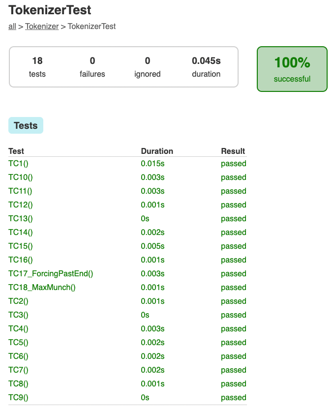

# Mall för inlämning laboration 1, 1dv610

## Checklista
- [x] I min tokeniserare finns inga tokentyper eller reg-exp. Dessa finns i mitt testprojekt eftersom de skapas utav användaren.
- [x] Jag har skrivit all kod och reflektioner själv. Jag har inte använt mig av andras kod för att lösa uppgiften.
- [x] Mina testresultat är skrivna utifrån utförd testning ( och inte teoretiskt, det bör fungera :) )
- [x] De enda statiska metoder eller funktioner utanför klasser som jag har är för att starta upp min testapplikation ex main(java).
- [x] De enda bibliotek och färdiga klasser som används är sådana som måste användas (eller som används för att testa modulen).

## Egenskattning och mål
- [ ] Jag är inte klar eftersom jag vet att jag saknar något. Då skall du inte lämna in!
- [x] Jag eftersträvar med denna inlämning godkänt betyg (E-D)
    - [x] De flesta testfall fungerar
    - [x] Koden är förberedd på Återanvändning
    - [x] All kod samt historik finns i git
    - [  ] Kodkvalitetskraven är ifyllda
    - [  ] Reflektion är skriven
- [ ] Jag eftersträvar med denna inlämning högre betyg (C-B) och anser mig uppfylla alla extra krav för detta.
    - [x] Samtliga testfall är skrivna
    - [x] Egna testfall för Maximal munch och kantfall
    - [x] Testfall är automatiserade
    - [  ] Det finns en tydlig beskrivning i hur modulen skall användas (i git)
    - [  ] Kodkvalitetskraven är varierade
- [ ] Jag eftersträvar med denna inlämning högsta betyg (A)

Förtydligande: Examinator kommer sätta betyg oberoende på vad ni anser.

## Återanvändning
1. Beskriv hur du anpassat din kod och instruktioner för att någon annan programmerare skall kunna använda din tokenizer. Om du skrivit instruktioner för din användare länka till dessa. Om inte beskriv här hur någon skall göra för att använda din kod med sin egen grammatik.

## Beskrivning av min kod
2. Beskriv din kod på en hög abstraktionsnivå. En kort beskrivning av dina viktigaste klasser och metoder. Skapa gärna ett klassdiagram som bild.

## Hur jag testat
3. Beskriv hur du kommit fram till om din kod fungerar.

### Testfall
4. Lista de enskilda testfallen. **Fetmarkera** sådant som du själv fyllt i. En rad per testfall.

| Namn      | Grammatik  | Sträng | Sekvens | Förväntat Aktivt Token | PASS/FAIL |
| --------- | ---------- | ------ | ------- | ------------ | --------- |
| TC1       | WordAndDot | "a"    | []      | WORD "a"     | PASS      |
| TC2       | WordAndDot | "a aa" | [>]     | WORD "aa"    | PASS      |
| TC3       | WordAndDot | "a.b"  | [>]     | DOT "."      | PASS      |
| TC4       | WordAndDot | "a.b"  | [>>]    | **WORD "b"** | PASS      |
| TC5       | WordAndDot | "aa. b" | **[>>]** | WORD "b"   | PASS      |
| TC6       | WordAndDot | "a .b" | [>><]   | DOT "."      | PASS      |
| TC7       | WordAndDot | ""     | []      | END **""**   | PASS      |
| TC8       | WordAndDot | " "    | []      | **END ""**   | PASS      |
| TC9       | WordAndDot | "a"    | **[>]** | END **""**   | PASS      |
| TC10      | WordAndDot | "a"    | [<]     | **WORD "a"** | PASS      |
| TC11      | WordAndDot | "!"    | []      | Exception    | PASS      |
| TC12      | Arithmetic | "3"    | []      | NUMBER "3"   | PASS      |
| TC13      | Arithmetic | "3.14" | []      | NUMBER "3.14" | PASS     |
| TC14      | Arithmetic | "3 + 54 * 4" | [>>>] | MUL "*"  | PASS      |
| TC15      | Arithmetic | "3+5 # 4" | [>>>] | **Exception** | PASS    |
| TC16      | Arithmetic | "3.0+54.1     + 4.2" | [><>>>] | **ADD "+"** | PASS      |

Du kan tillföra kommentarer om din tokeniserare skiljer sig något från standard.

### Testfall för högre betyg
| Namn      | Grammatik  | Sträng | Sekvens | Förväntat Aktivt Token | PASS/FAIL |
| --------- | ---------- | ------ | ------- | ------------ | --------- |
| TC17_ForcingPastEnd | Arithmetic | "3.0+54.1+4.2" | [>>>>>>] | END "" | PASS      |
| TC18_MaxMunch | MaxMunch | "3.0 54.1" | [>] | FLOAT "54.1" | PASS      |

## Kodkvalitetskrav

**Fetmarkera** de "regler" som används ur CC. Ni kan frångå tabellformat om ni vill. Skapa direktlänkar till er kod där det är lämpligt.

### Namngivning
6.
| Namn och förklaring  | Reflektion                                   |
| -------------------  | ---------------------------------------------|
| Tokenizer            |                                              |
| next()               |                                              |
| previous()           |                                              |
| getActiveToken()     |                                              |
|                      |                                              |

### Funktioner
7.
| Metodnamn och förklaring  | Reflektion                              |
| -------------------  | ---------------------------------------------|
| match()              |                                              |
|                      |                                              |
|                      |                                              |
|                      |                                              |
|                      |                                              |

## Laborationsreflektion
8. Reflektera över uppgiften utifrån ett kodkvalitetsperspektiv. Använd begrepp ifrån boken. 
