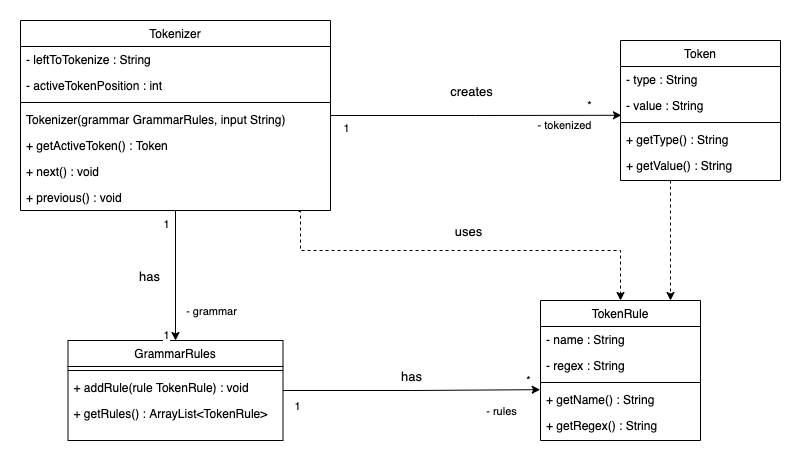

# Mall för inlämning laboration 1, 1dv610

## Checklista
- [x] I min tokeniserare finns inga tokentyper eller reg-exp. Dessa finns i mitt testprojekt eftersom de skapas utav användaren.
- [x] Jag har skrivit all kod och reflektioner själv. Jag har inte använt mig av andras kod för att lösa uppgiften.
- [x] Mina testresultat är skrivna utifrån utförd testning ( och inte teoretiskt, det bör fungera :) )
- [x] De enda statiska metoder eller funktioner utanför klasser som jag har är för att starta upp min testapplikation ex main(java).
- [x] De enda bibliotek och färdiga klasser som används är sådana som måste användas (eller som används för att testa modulen).

## Egenskattning och mål
- [ ] Jag är inte klar eftersom jag vet att jag saknar något. Då skall du inte lämna in!
- [x] Jag eftersträvar med denna inlämning godkänt betyg (E-D)
    - [x] De flesta testfall fungerar
    - [x] Koden är förberedd på Återanvändning
    - [x] All kod samt historik finns i git
    - [x] Kodkvalitetskraven är ifyllda
    - [x] Reflektion är skriven
- [ ] Jag eftersträvar med denna inlämning högre betyg (C-B) och anser mig uppfylla alla extra krav för detta.
    - [x] Samtliga testfall är skrivna
    - [x] Egna testfall för Maximal munch och kantfall
    - [x] Testfall är automatiserade
    - [x] Det finns en tydlig beskrivning i hur modulen skall användas (i git)
    - [x] Kodkvalitetskraven är varierade
- [ ] Jag eftersträvar med denna inlämning högsta betyg (A)

Förtydligande: Examinator kommer sätta betyg oberoende på vad ni anser.

## Återanvändning
Beskrivning för en ny användare utav Tokenizer:
- [./README.md](./README.md)
- [GitLab-länk](https://gitlab.lnu.se/1dv610/student/pr222ja/l1/-/blob/master/README.md)

## Beskrivning av min kod
Tokenizern tar in en input-sträng som kan tokenizeras och en grammatik fylld med olika regler. Reglerna har regex-uttryck som sedan används för att matchas mot inputen och utifrån matchningarna skapar Tokenizern Tokens. Ett token innehåller då värdet som matchningen resulterade i samt benämning på typ av matching utifrån regelns namn.

Genom metoden getActiveToken() kan man få ut tokenet i den positionen som tokenizeraren befinner sig i för tillfället. Genom metoderna next() och previous() kan man förflytta den positionen och varje gång next() anropas så körs även en ny matchning om det finns något kvar att matcha utav inputen. 

## Hur jag testat
Testning har gjorts genom att först skapa automatiska tester som sedan utnyttjats under utvecklingens gång. Jag har även testat explorativt i App-classens main-funktion genom att logga ut saker men dessa har tagits bort allteftersom.

Länk till test-klass: [TestTokenizer](https://gitlab.lnu.se/1dv610/student/pr222ja/l1/-/blob/master/src/test/java/Tokenizer/TokenizerTest.java)

### Testfall
| Namn      | Grammatik  | Sträng | Sekvens | Förväntat Aktivt Token | PASS/FAIL |
| --------- | ---------- | ------ | ------- | ------------ | --------- |
| TC1       | WordAndDot | "a"    | []      | WORD "a"     | PASS      |
| TC2       | WordAndDot | "a aa" | [>]     | WORD "aa"    | PASS      |
| TC3       | WordAndDot | "a.b"  | [>]     | DOT "."      | PASS      |
| TC4       | WordAndDot | "a.b"  | [>>]    | **WORD "b"** | PASS      |
| TC5       | WordAndDot | "aa. b" | **[>>]** | WORD "b"   | PASS      |
| TC6       | WordAndDot | "a .b" | [>><]   | DOT "."      | PASS      |
| TC7       | WordAndDot | ""     | []      | END **""**   | PASS      |
| TC8       | WordAndDot | " "    | []      | **END ""**   | PASS      |
| TC9       | WordAndDot | "a"    | **[>]** | END **""**   | PASS      |
| TC10      | WordAndDot | "a"    | [<]     | **WORD "a"** | PASS      |
| TC11      | WordAndDot | "!"    | []      | Exception    | PASS      |
| TC12      | Arithmetic | "3"    | []      | NUMBER "3"   | PASS      |
| TC13      | Arithmetic | "3.14" | []      | NUMBER "3.14" | PASS     |
| TC14      | Arithmetic | "3 + 54 * 4" | [>>>] | MUL "*"  | PASS      |
| TC15      | Arithmetic | "3+5 # 4" | [>>>] | **Exception** | PASS    |
| TC16      | Arithmetic | "3.0+54.1     + 4.2" | [><>>>] | **ADD "+"** | PASS      |

Kommentar: Kastandet utav undantag när en matchning inte kunde göras enligt givna regler körs inte i samband med anrop till aktiv token. Kastandet görs redan vid förflyttningen i samband med anrop till nästa token. Därav är det exempelvis inte möjligt att flytta sig till 'END'-tokenet utan att undantag kastas, även om man aldrig anropar efter aktivt token.

### Testfall för högre betyg
| Namn      | Grammatik  | Sträng | Sekvens | Förväntat Aktivt Token | PASS/FAIL |
| --------- | ---------- | ------ | ------- | ------------ | --------- |
| TC17_ForcingPastEnd | Arithmetic | "3.0+54.1+4.2" | [>>>>>>] | END "" | PASS      |
| TC18_MaxMunch | MaxMunch | "3.0 54.1" | [>] | FLOAT "54.1" | PASS      |

### Samma resultat visat utav Gradle:

## Kodkvalitetskrav
### Namngivning
| Namn och förklaring  | Reflektion                                   |
| -------------------  | ---------------------------------------------|
| [Token Tokenizer.getActiveToken()](https://gitlab.lnu.se/1dv610/student/pr222ja/l1/-/blob/master/src/main/java/Tokenizer/Tokenizer.java#L25) - returnerar "aktivt" token     | /**Avoid disinformation**/ ---> I nuvarande implementeringen utav tokeniseraren så kan namnet vara lite missvisande. Antagandet utifrån namnet skulle antagligen vara att det finns en klassvariabel som troligen heter activeToken och att man får tillgång till den genom den här metoden. getTokenAtCurrentPosition() hade varit ett mer korrekt namn men eftersom positionshanteringen var lite utav en första lösning för att testa att flödet utav tokenizeraren fungerar så har jag låtit metodnamnet vara kvar. På så sätt låter jag det vara mer flexibelt för framtida lösningar utav implementationen samtidigt som den som använder publika interfacet fortfarande får samma resultat.                                             |
| [void Tokenizer.next()](https://gitlab.lnu.se/1dv610/student/pr222ja/l1/-/blob/master/src/main/java/Tokenizer/Tokenizer.java#L29) - förflytta sig ett steg framåt               | /**Don't pun**/ ---> Även om modulen i sig inte kör en pun, har två av samma namn som gör olika saker. Så är metodnamnet såpass generiskt att den i samband med användande utav annan kod eller moduler att risken blir väldigt hög för att bli en pun. Utifrån nuvarande implementation så som diskuterat för getActiveToken()-metoden så skulle ett per särskiljande namn kunna bli goToNextPosition() eller liknande. Men eftersom jag vill hålla implementationen bakom kulisserna mer flexibel och eventuellt inte beröra position så valde jag att ha kvar det. Alternativt hade jag kunnat ändra i stil med det jag nämner nedan för previous()-metoden med verb tillsammans med besrkivande ord för verbet och på så sätt undvika risken för "puns" och behålla neutralitet för implementationen.                                       |
| [void Tokenizer.previous()](https://gitlab.lnu.se/1dv610/student/pr222ja/l1/-/blob/master/src/main/java/Tokenizer/Tokenizer.java#L50) - förflytta sig ett steg bakåt           | /**Method Names**/ ---> Previous är inte ett verb trots att metoder borde vara verb. Det hade varit mer logiskt om metoden returnerade ett objekt som ligger precis bredvid det objektet som previous anropas på. Det hade kunnat vara bättre att använda ett verb så som go, move eller step och sedan lägga till något besrkivande ord för att gå bakåt, exempelvis stepBack().                                            |
| [GrammarRules](https://gitlab.lnu.se/1dv610/student/pr222ja/l1/-/blob/master/src/main/java/Tokenizer/GrammarRules.java#L8) - samlingklass för de regler som kan matchas    | /**One Word Per Concept**/ ---> Jag försökte leka runt lite extra i början med "smarta" namngivningar men insåg delvis att jag snabbt förvirrade mig mer än litade på det första-bästa-valet. I det här fallet så borde jag troligen bara stannat vid att låta klassen helt enkelt heta "Grammar" eftersom det är det övergripande konceptet. Dessutom har grammatiken regler, så därav logiskt att den hade bara haft "Grammar" som namn och sin samling av regler som redan finns som i klassvariabeln "rules".                                            |
| [TokenRule](https://gitlab.lnu.se/1dv610/student/pr222ja/l1/-/blob/master/src/main/java/Tokenizer/TokenRule.java#L3) - token-klass med regex för matchning  | /**Add meaningful context**/ ---> Efter diskussioner om uppgiften så insåg jag att det var lätt att förväxla vilken token som menades, den ena menade Token som den som tokenizeraren ger ut och den andre menade den som hade regex-uttrycket som skulle matchas. Första instinkten till klassen med regex efter det var att namnge den i stil med MatchToken. Men eftersom Match-delen skulle kunna anspela på matchningsfunktionalitet eller egenskap av något slag så ville jag försöka göra det ännu tydligare om vad den här typen utav en Token verkligen handlar om. Jag hade kanske kunnat nöja mig med att kalla klassen helt enkelt för Rule, men i det här fallet är det inte vilka regler som helst utan jag ville göra det tydligare att det är en regel för tokens.                                    |

### Funktioner
| Metodnamn och förklaring                                | Reflektion                                   |
| -------------------                                     | ---------------------------------------------|
| [Token Tokenizer.matchToken(rule)](https://gitlab.lnu.se/1dv610/student/pr222ja/l1/-/blob/master/src/main/java/Tokenizer/Tokenizer.java#L85) - Försöker hitta en matchning                       | /**Do one thing**/ ---> Egentligen gör den här metoden två saker, kollar efter en matchning och sedan returnerar den ett skapat nytt token. För att göra om den så att den bara gör en sak så skulle man kunna låta den returnera endast det matchade värdet och sedan ha en separat funktion som skapar ett nytt token utifrån det värdet. /**No side effects**/ ---> När man läser igenom koden så blir det kanske inte så uppenbart i första hand att man får tillbaka en Token även om en matchning faktiskt inte lyckades. Så särskilt ur det perspektivet så skulle det behövas göras en tydligare separation mellan funktioner om när något kollas efter en matchning och när det utifrån det är värt att skapa en ny Token och eventuellt då ha en array av matchade tokens som sedan i slutet kan kollas igenom för vilken utav dom som är bäst och välja slutliga tokenet då.           |
| [Token Tokenizer.match()](https://gitlab.lnu.se/1dv610/student/pr222ja/l1/-/blob/master/src/main/java/Tokenizer/Tokenizer.java#L69) - Loopar igenom för att hitta bästa matchningen                                | /**Use Descriptive Names**/ ---> Bara "match" säger inte så mycket, vad är det som matchas eller hur är det något som ska matchas. Eftersom metoden loopar igenom alla grammatiker och letar efter bästa matchningen så hade ett första steg varit eventuellt att namnge metoden till något i stil med matchWithAllGrammars. Men med tanke på att metoden returnerar den bästa matchningen så hade kanske det varit ännu tydligare med findTheBestMatch(). /**Small!**/ ---> Metoden är fortfarande rätt lång även om väldigt mycket lyckats bryta ut ner till mindre funktioner för att lyckas komma ner till max 2 indragninar. För att hålla koll på de olika matchingarna så hade kanske en smart men mer tidskrävande lösning vara att skapa en egen matchnings-klass som hjälper tokeniseraren. Däremot ett första steg till att minska ner den ytterligare utan att behöva ändra variabelstrukturerna vore att flytta ut nedre if-satsen till en egen fristående metod som skulle kunna heta checkValidMatch istället och som fortfarande tar in bästa matchningen som argument.                                              |
| [Token Tokenizer.maxMunch(latestMatch, bestMatchSoFar)](https://gitlab.lnu.se/1dv610/student/pr222ja/l1/-/blob/master/src/main/java/Tokenizer/Tokenizer.java#L102) - Kollar vilken som har längst värde  | /**Function Arguments**/ ---> Metoden är dyadisk, tar in två parametrar, vilket kan medföra onödig förvirring om vilken ordning de ska komma i och slöseri med tid för att dubbelkolla signaturen varje gång. Metoden är ett försök till att bryta loss lite logik ur "huvudmetoderna" och jag hade inte direkt något förbestämt hur bästa matchningen på ett smidigt sätt sparas. Så eventuell ändring skulle kunna vara att maxMunch-metoden redan inbyggt har tillgång till bästa matchningen hittills och att man endast behöver skicka in den som man vill kolla efter.                                       |
| [void Tokenizer.tokenize()](https://gitlab.lnu.se/1dv610/student/pr222ja/l1/-/blob/master/src/main/java/Tokenizer/Tokenizer.java#L60) - startpunkt för en matchningsprocess                             |  /**Do one thing**/ ---> Som ett övergripande koncept så går det kanske att säga att metoden gör en övergripande sak, tittar man däremot närmare på kodraderna så verkar ändå en del saker hända. Först att det kollas om det finns något att tokenisera, sedan hämta ut en matchning, lägga in den före END-tokenet och till sist en upprensningsfunktion. Det var förstås lockande att lägga in förflyttning utav aktiv token även här så på så sätt är metoden ändå hysfat avskalad och omfamnar tokeniseringsförfarandet. För att snygga till metoden så skulle if-satsen kunna få vara kvar och att på något sätt ersätta variabeln utav matchningen till att det blir en metod som tar hand om matchingen så att de tre delarna matchning, lägga in matchningen och rensningen, radas upp i tre steg istället. Metoden skulle då kunna heta något i stil med makeAMatchedToken() och då kanske ha matchade tokenet som en klassvariabel så att den slipper läggas in som argument till de nästföljande metoderna.                                            |
| [void Tokenizer.next()](https://gitlab.lnu.se/1dv610/student/pr222ja/l1/-/blob/master/src/main/java/Tokenizer/Tokenizer.java#L29) - publika metoden för att gå ett steg framåt                                  | /**Small!**/ ---> Trots att jag har lyckats få ner indragningarna på de flesta metoderna så är den här fortfarande uppe i 3 indragningar. Jag ser nu att jag skulle kunna bryta ut det som ligger i den yttersta if-satsen till en egen metod som säger något om att förflytta sin aktiva position ett steg framåt. Då kan den inre if-satsen vara kvar för att kolla om det är värt att skapa en ny token eller inte och avsluta med att flytta ett steg framåt. Jag skulle också kunna ändra att metoden kastar undantag om första if-satsen inte går igenom så att det blir tydligare för användaren att denne försökt gå utanför tillgängliga tokens. /**Abstraction level**/ ---> Nu har jag lite av en fuling kvar genom att hålla koll på positionen utav aktiva tokenet med en int som jag ökar eller minskar direkt i de publika metoderna och därmed lägger in en låg abstraktionsnivå i den översta nivån utav interfacet. Det hade gått att skapa privata funktioner med besrkivande namn som fått ta hand om lågabstraktionsnivån som senare skulle kunna ändras utan att behöva röra de publika metoderna.                                             |

## Laborationsreflektion
Jag har fått ett helt annat sätt att tänka kring hur man kan skapa funktioner. Tidigare har vi blivit påtvingade metodskommentarer som snabbt tar upp väldigt mycket plats och ska man försöka hålla en klass inom rimligt antal rader att scrolla sig igenom så blir kandidaterna för små metoder hellre kvar i den stora funktionen.

Bortsett från metoden för att hämta aktivt token och för att stega framåt och bakåt så skrev jag först en enda metod med nästan all funktionalitet i sig. Under refaktorerings-processen koden så började jag då anamma Robert C. Martins perspektiv av att funktioner ska vara "Små!". Små så som i så få rader som möjligt och i att begränsa sig till antalet indragningar i vardera funktion.

Han tar även upp att metoder ska börja med hög abstraktion och allteftersom gå längre ner i abstraktionsnivå. Så även om jag på något ställe kanske blandar in en lägre nivå i en högre metod, och att det finns säkerligen utrymme för förbättring, så har jag ändå lyckats lyfta abstraktionsnivån väsentligt från hur koden såg ut till att börja med.

Vanligtvis är jag hyfsat bra på att följa regeln ”Don’t repeat yourself” men här smög sig en liten upprepning in som tog ett tag innan jag lyckades se den. Jag körde en boolean-check innan varje anrop för att påbörja tokenisering. Efter upptäckten ändrade jag så att checken istället körs direkt i metoden som har ansvar för tokeniseringsförfarandet istället.

Genom behovet utav att använda mig utav Javas hjälp-klasser Pattern och Matcher så har det också gett mig ett djupare perspektiv i hur objektorienterad kod är tänkt att kunna fungera. I tidigare kurser så har upplevelsen bara varit att ta in moduler och använda enskilda metoder ur dom, jämfört med att som i det här fallet skapa ett "levande objekt" att arbeta med. 